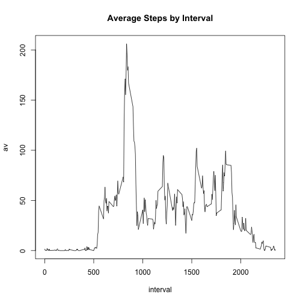

Wearable Fitness Analysis Reproducibility Project
========================================================

In this document we do some prelimiary and basic analyses on the activity data under the assumption that the data is in the present working directory. We use the plyr library to clean and manipulate data. We throw away all intervals with missing step counts out at the outset, for simplicity's sake.


```r
library(plyr)
data <- read.csv('activity.csv')
no_na <- data[!is.na(data$steps),]
```

We sum the steps over the date fields for those which have no na values.

```r
per_dia <- ddply(no_na, .(date), summarize, pd = sum(steps))
head(per_dia)
```

```
##         date    pd
## 1 2012-10-02   126
## 2 2012-10-03 11352
## 3 2012-10-04 12116
## 4 2012-10-05 13294
## 5 2012-10-06 15420
## 6 2012-10-07 11015
```
Calculations for mean and median steps per day:

```r
mean(per_dia$pd)
```

```
## [1] 10766.19
```

```r
median(per_dia$pd)
```

```
## [1] 10765
```

Histogram of step data, and log(step + 1) per day:

```r
hist(per_dia$pd, xlab="Steps per Day", main="Steps per Day")
```


```r
hist(log(per_dia$pd + 1), xlab="Log of Steps per Day", main="Log of Steps per Day")
```


Time series plot of average steps, and code for creating these averages:

```r
day_averages <- ddply(no_na, .(date), summarize, av = mean(steps))
plot(av ~ date, day_averages, main="Average Steps by Day")
lines(day_averages$date, day_averages$av, type="l")
```


Code for finding the five minute interval that on average contains the maximum number of steps. Also creates plot for this data. Interval with highest average is the 835th.

```r
interval_averages <- ddply(no_na, .(interval), summarize, av = mean(steps))
interval_averages[interval_averages$av == max(interval_averages$av),]$interval
```

```
## [1] 835
```

```r
plot(av ~ interval, data=interval_averages, type="l", main="Average Steps by Interval")
```



In order to represent missing data we will fill in with the average for that interval over all days. This is at least somewhat legitimate since the average should represent the _typical_ behavior for a given interval on any given day. We then generate a histogram of steps per day for this new set.

```r
imputed <- data
imputed[is.na(data$steps),]$steps = interval_averages$av
imputed_per_dia <- ddply(imputed, .(date), summarize, pd=sum(steps))
#We test that it really is full now
imputed_per_dia[is.na(imputed_per_dia$steps),]
```

```
## Warning in is.na(imputed_per_dia$steps): is.na() applied to non-(list or
## vector) of type 'NULL'
```

```
## [1] date pd  
## <0 rows> (or 0-length row.names)
```

```r
hist(imputed_per_dia$pd, xlab="Steps per Day", main = "Steps per Day (Imputed)")
```


```r
hist(log(imputed_per_dia$pd + 1), xlab="Log of Steps per Day", main="Log of Steps per Day (Imputed)")
```


Lastly, we generate a panel plot comparing average number of steps taken per 5-minute interval across weekdays and weekends.

```r
with_days <- ddply(imputed, .(), mutate, day_of_week = weekdays(as.POSIXlt(imputed$date)))
# Data Manipulation
weekday <- c("Monday", "Tuesday", "Wednesday", "Thursday", "Friday")
weekday_data <- ddply(with_days[with_days$day_of_week %in% weekday,], 
                      .(interval), 
                      summarize, 
                      av=mean(steps))
#head(weekday_data)
weekend <- c("Saturday", "Sunday")
weekend_data <- ddply(with_days[with_days$day_of_week %in% weekend,],
                      .(interval),
                      summarize,
                      av=mean(steps))
#head(weekend_data)
par(mfrow=c(1,2), oma=c(1,1,1,1))
plot(av ~ interval, data=weekday_data, main="Weekday: Steps by Interval", type="l", ylab="Steps", xlab="Interval")
plot(av ~ interval, data=weekend_data, main="Weekend: Steps by Interval", type="l", ylab="Steps", xlab="Interval")
```


